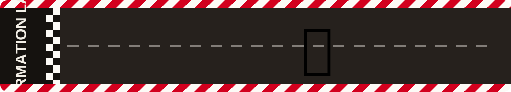

  

  
  

---

🏎️ **Preprocessing of 3T structural and functional MRI**
Preprocessing pipeline for 3T structural and functional MRI data including denoising, motion correction, coregistration and surface parcellation.

[View the repository here →](#)

🏎️ **Population receptive field mapping**
Pipeline to perform Population receptive field mapping at 3T: fitting receptive fields to vertex based on the visual stimulation in your 3T scanner to analyze the retinotopic organization of the brain.

[View the repository here →](#)

🏎️ **Bayesian connective field modeling**
Pipeline to compute the connective fields across visual areas, predicting how the activitiy in a vertex of the target area predicts the activity of the vertex in a source area, mapping the cortico-cortical connections between visual field maps. 

[View the repository here →](#)

🏎️ **Preprocessing of 7T structural and functional MRI at the laminar level**
Preprocessing pipeline adapted for ultra-high-field (7T) MRI data, handling the extra distortion and SNR challenges that come with high-resolution acquisitions.

[View the repository here →](#)

🏎️ **Connective field modeling on 7T functional MRI Across layers**
Connective field modeling applied to 7T data, using the higher spatial resolution to sharpen cortico-cortical mapping estimates.

[View the repository here →](#)

*(Swap the five `#` placeholders above for your actual repo URLs.)*

---

## About me

- Currently working on: Connective Field modeling on 7T fMRI data
- Currently learning: *add a skill/tool you're picking up*
- Ask me about: pRF mapping, connective field modeling, high-field (7T) fMRI preprocessing
- Reach me: f.cardillo@umcg.nl

## Tech stack

  
  
  
  

> Swap or add badges from [shields.io](https://shields.io/) or [skillicons.dev](https://skillicons.dev/) to match your actual stack.

## GitHub stats

  
  

  

## Connect with me

  
  
  

